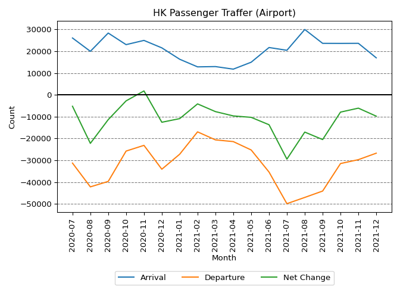
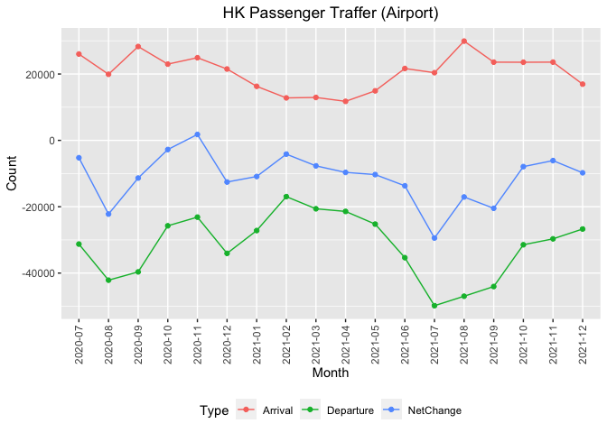

HK Immigration Passenger Traffic
================

## Data Source

On each day, the [Hong Kong Immigration
Department](https://immd.gov.hk/eng/index.html) will update the
passenger traffic at different control point of the previous day. For
example, the passenger traffic statistics on `2021-12-16` can be found
from the url below.

    https://www.immd.gov.hk/eng/stat_20211216.html

By changing the date in the above url, the passenger traffic data of a
particular date can be found.

## Data Extraction With Python

The function below takes a date value and return the “Passenger Traffic
Statistic” on that day from the Immigration Department website.

``` python
import requests
from bs4 import BeautifulSoup as bs
import pandas as pd
from datetime import datetime
from datetime import date
from datetime import timedelta
import re
import matplotlib.pyplot as plt

def getImmigrationStatDaily(d):
    url = "https://www.immd.gov.hk/eng/stat_{}.html".format(d.strftime("%Y%m%d"))
    response = requests.get(url)
    soup = bs(response.content, "html.parser")
    tr = soup.select("tbody tr")
    pattern = re.compile(r"(Arrival|Departure)")
    rows = list()
    for i in range(len(tr)):
        td = tr[i].select("td")
        hasHeader = list(map(lambda y: "headers" in set(y.attrs.keys()), td))
        td = [td[j] for j, x in enumerate(hasHeader) if x]
        headers = [cell.get_attribute_list("headers")[0] for cell in td]
        value = [cell.text for cell in td]
        value = [int(x.replace(",", "")) if bool(pattern.search(headers[i])) else x for i, x in enumerate(value)]
        rows.append(dict(zip(headers, value)))
    result = pd.DataFrame(rows)
    result[["Date"]] = d
    return(result)

df = getImmigrationStatDaily(date(2021,12,16))
```

| Control_Point                  | Hong_Kong_Residents_Arrival | Mainland_Visitors_Arrival | Other_Visitors_Arrival | Total_Arrival | Hong_Kong_Residents_Departure | Mainland_Visitors_Departure | Other_Visitors_Departure | Total_Departure | Date                        |
|:-------------------------------|----------------------------:|--------------------------:|-----------------------:|--------------:|------------------------------:|----------------------------:|-------------------------:|----------------:|:----------------------------|
| Airport                        |                         867 |                        10 |                     30 |           907 |                          1693 |                          15 |                       43 |            1751 | \<environment: 0x12a46e710> |
| Express Rail Link West Kowloon |                           0 |                         0 |                      0 |             0 |                             0 |                           0 |                        0 |               0 | \<environment: 0x12a462d30> |
| Hung Hom                       |                           0 |                         0 |                      0 |             0 |                             0 |                           0 |                        0 |               0 | \<environment: 0x12a45be78> |
| Lo Wu                          |                           0 |                         0 |                      0 |             0 |                             0 |                           0 |                        0 |               0 | \<environment: 0x12a44e6d8> |
| Lok Ma Chau Spur Line          |                           0 |                         0 |                      0 |             0 |                             0 |                           0 |                        0 |               0 | \<environment: 0x12a444e80> |
| Heung Yuen Wai                 |                           0 |                         0 |                      0 |             0 |                             0 |                           0 |                        0 |               0 | \<environment: 0x12a43d698> |
| Hong Kong-Zhuhai-Macao Bridge  |                         189 |                        10 |                     32 |           231 |                           208 |                          12 |                        9 |             229 | \<environment: 0x12a4302b0> |
| Lok Ma Chau                    |                           0 |                         0 |                      0 |             0 |                             0 |                           0 |                        0 |               0 | \<environment: 0x12a426a58> |
| Man Kam To                     |                           0 |                         0 |                      0 |             0 |                             0 |                           0 |                        0 |               0 | \<environment: 0x12a41d270> |
| Sha Tau Kok                    |                           0 |                         0 |                      0 |             0 |                             0 |                           0 |                        0 |               0 | \<environment: 0x12a4125c0> |
| Shenzhen Bay                   |                        1028 |                       307 |                     11 |          1346 |                           897 |                         109 |                        2 |            1008 | \<environment: 0x12a409dd0> |
| China Ferry Terminal           |                           0 |                         0 |                      0 |             0 |                             0 |                           0 |                        0 |               0 | \<environment: 0x12a3fe828> |
| Harbour Control                |                           0 |                         0 |                      0 |             0 |                             0 |                           0 |                        0 |               0 | \<environment: 0x12a3eca20> |
| Kai Tak Cruise Terminal        |                        1879 |                         0 |                      0 |          1879 |                          2048 |                           0 |                        0 |            2048 | \<environment: 0x12a3e55f0> |
| Macau Ferry Terminal           |                           0 |                         0 |                      0 |             0 |                             0 |                           0 |                        0 |               0 | \<environment: 0x12a3d7cb8> |
| Tuen Mun Ferry Terminal        |                           0 |                         0 |                      0 |             0 |                             0 |                           0 |                        0 |               0 | \<environment: 0x12a3cce80> |
| Total                          |                        3963 |                       327 |                     73 |          4363 |                          4846 |                         136 |                       54 |            5036 | \<environment: 0x12a3c3890> |

## Data Extraction With R

The function below takes a date value and return the “Passenger Traffic
Statistic” on that day from the Immigration Department website.

``` r
getImmigrationStatDaily <- function(d) {
  url <- sprintf("https://www.immd.gov.hk/eng/stat_%s.html", format(d, "%Y%m%d"))
  response <- httr::content(httr::GET(url), encoding = "UTF-8")
  tr <- rvest::html_nodes(response, "tbody tr")
  result <- as.data.frame(t(sapply(tr, function(x) {
    y <- rvest::html_nodes(x, "td")
    y <- y[grep("headers", y)]
    r <- rvest::html_text(y)
    names(r) <- rvest::html_attr(y, "headers")
    return(r)
  })))
  cols <- grep("(Arrival|Departure)$", names(result))
  result[, cols] <- as.data.frame(lapply(result[, cols], function(x) as.numeric(gsub("[^0-9]", "", x))))
  if (ncol(result) > 1) result$Date <- d else stop(paste0("No Data on ", d))
  return(result)
}

df <- getImmigrationStatDaily(as.Date("2021-12-16"))
```

``` r
knitr::kable(df)
```

| Control_Point                  | Hong_Kong_Residents_Arrival | Mainland_Visitors_Arrival | Other_Visitors_Arrival | Total_Arrival | Hong_Kong_Residents_Departure | Mainland_Visitors_Departure | Other_Visitors_Departure | Total_Departure | Date       |
|:-------------------------------|----------------------------:|--------------------------:|-----------------------:|--------------:|------------------------------:|----------------------------:|-------------------------:|----------------:|:-----------|
| Airport                        |                         867 |                        10 |                     30 |           907 |                          1693 |                          15 |                       43 |            1751 | 2021-12-16 |
| Express Rail Link West Kowloon |                           0 |                         0 |                      0 |             0 |                             0 |                           0 |                        0 |               0 | 2021-12-16 |
| Hung Hom                       |                           0 |                         0 |                      0 |             0 |                             0 |                           0 |                        0 |               0 | 2021-12-16 |
| Lo Wu                          |                           0 |                         0 |                      0 |             0 |                             0 |                           0 |                        0 |               0 | 2021-12-16 |
| Lok Ma Chau Spur Line          |                           0 |                         0 |                      0 |             0 |                             0 |                           0 |                        0 |               0 | 2021-12-16 |
| Heung Yuen Wai                 |                           0 |                         0 |                      0 |             0 |                             0 |                           0 |                        0 |               0 | 2021-12-16 |
| Hong Kong-Zhuhai-Macao Bridge  |                         189 |                        10 |                     32 |           231 |                           208 |                          12 |                        9 |             229 | 2021-12-16 |
| Lok Ma Chau                    |                           0 |                         0 |                      0 |             0 |                             0 |                           0 |                        0 |               0 | 2021-12-16 |
| Man Kam To                     |                           0 |                         0 |                      0 |             0 |                             0 |                           0 |                        0 |               0 | 2021-12-16 |
| Sha Tau Kok                    |                           0 |                         0 |                      0 |             0 |                             0 |                           0 |                        0 |               0 | 2021-12-16 |
| Shenzhen Bay                   |                        1028 |                       307 |                     11 |          1346 |                           897 |                         109 |                        2 |            1008 | 2021-12-16 |
| China Ferry Terminal           |                           0 |                         0 |                      0 |             0 |                             0 |                           0 |                        0 |               0 | 2021-12-16 |
| Harbour Control                |                           0 |                         0 |                      0 |             0 |                             0 |                           0 |                        0 |               0 | 2021-12-16 |
| Kai Tak Cruise Terminal        |                        1879 |                         0 |                      0 |          1879 |                          2048 |                           0 |                        0 |            2048 | 2021-12-16 |
| Macau Ferry Terminal           |                           0 |                         0 |                      0 |             0 |                             0 |                           0 |                        0 |               0 | 2021-12-16 |
| Tuen Mun Ferry Terminal        |                           0 |                         0 |                      0 |             0 |                             0 |                           0 |                        0 |               0 | 2021-12-16 |
| Total                          |                        3963 |                       327 |                     73 |          4363 |                          4846 |                         136 |                       54 |            5036 | 2021-12-16 |

## Airport Passenger Traffic Using Python

Below shows an example of extracting the airport passenger traffic using
Python.

``` python
startdate = date(2020,7,1)
enddate = date.today() - timedelta(days = 1)
dates = [startdate + timedelta(days = i) for i in range((enddate - startdate).days + 1)]
dfs = [getImmigrationStatDaily(x) for x in dates]
df = pd.concat(dfs).reset_index(drop = True)
```

``` python
airportTraffic = df[(df["Date"] >= dates[0]) & (df["Control_Point"] == "Airport")][["Hong_Kong_Residents_Arrival", "Hong_Kong_Residents_Departure"]]
airportTraffic = airportTraffic.reset_index(drop = True)
airportTraffic["NetChange"] = airportTraffic["Hong_Kong_Residents_Arrival"] - airportTraffic["Hong_Kong_Residents_Departure"]

yearMonths = [str(x.year) + "-" + str(x.month).zfill(2) for x in dates]
airportTrafficMonthly = airportTraffic.groupby(yearMonths).sum()
airportTrafficMonthly["Month"] = list(airportTrafficMonthly.index)
airportTrafficMonthly = airportTrafficMonthly.reset_index(drop=True)
airportTrafficMonthly = airportTrafficMonthly[["Month", "Hong_Kong_Residents_Arrival", "Hong_Kong_Residents_Departure", "NetChange"]]
Total = airportTrafficMonthly.sum(numeric_only=True).append(pd.Series("Total"))
Total.index = list(Total.index)[0:3] + ["Month"]
outdf = airportTrafficMonthly.append(Total, ignore_index=True)
```

| Month   | Hong_Kong_Residents_Arrival | Hong_Kong_Residents_Departure | NetChange |
|:--------|----------------------------:|------------------------------:|----------:|
| 2020-07 |                       26023 |                         31253 |     -5230 |
| 2020-08 |                       19921 |                         42136 |    -22215 |
| 2020-09 |                       28289 |                         39643 |    -11354 |
| 2020-10 |                       22984 |                         25748 |     -2764 |
| 2020-11 |                       24916 |                         23133 |      1783 |
| 2020-12 |                       21506 |                         34059 |    -12553 |
| 2021-01 |                       16292 |                         27182 |    -10890 |
| 2021-02 |                       12804 |                         16952 |     -4148 |
| 2021-03 |                       12938 |                         20619 |     -7681 |
| 2021-04 |                       11761 |                         21413 |     -9652 |
| 2021-05 |                       14930 |                         25239 |    -10309 |
| 2021-06 |                       21663 |                         35352 |    -13689 |
| 2021-07 |                       20397 |                         49832 |    -29435 |
| 2021-08 |                       29916 |                         46973 |    -17057 |
| 2021-09 |                       23575 |                         44049 |    -20474 |
| 2021-10 |                       23552 |                         31462 |     -7910 |
| 2021-11 |                       23584 |                         29680 |     -6096 |
| 2021-12 |                       16946 |                         26716 |     -9770 |
| Total   |                      371997 |                        571441 |   -199444 |

``` python
plt.plot(list(airportTrafficMonthly["Month"]), airportTrafficMonthly["Hong_Kong_Residents_Arrival"], label = "Arrival");
plt.plot(list(airportTrafficMonthly["Month"]), [-x for x in airportTrafficMonthly["Hong_Kong_Residents_Departure"]], label = "Departure");
plt.plot(list(airportTrafficMonthly["Month"]), airportTrafficMonthly["NetChange"], label = "Net Change");
plt.xticks(list(airportTrafficMonthly["Month"]), list(airportTrafficMonthly["Month"]), rotation='vertical');
plt.legend(loc = "lower center", bbox_to_anchor=(0.5, -0.4), ncol = 3);
plt.title("HK Passenger Traffer (Airport)");
plt.xlabel("Month");
plt.ylabel("Count");
plt.grid(axis = "y", linestyle='--', color = "#7c7c7c");
plt.axhline(0, color='k');
plt.tight_layout();
plt.show()
```

<!-- -->

## Airport Passenger Traffic Using R

Below shows an example of extracting the airport passenger traffic using
R.

``` r
dates <- seq(as.Date("2020-07-01"), Sys.Date() - 1, by = 1)
df <- plyr::rbind.fill(lapply(dates, getImmigrationStatDaily))
```

``` r
airportTraffic <- dplyr::filter(df, df$Control_Point == "Airport")[, c("Hong_Kong_Residents_Arrival", "Hong_Kong_Residents_Departure")]
airportTraffic$NetChange <- airportTraffic$Hong_Kong_Residents_Arrival - airportTraffic$Hong_Kong_Residents_Departure

yearMonths <- format(dates, "%Y-%m")
airportTrafficMonthly <- aggregate(airportTraffic, list(Month = yearMonths), sum)
knitr::kable(rbind(airportTrafficMonthly, as.data.frame(c(list(Month = "Total"), colSums(airportTrafficMonthly[, -1])))))
```

| Month   | Hong_Kong_Residents_Arrival | Hong_Kong_Residents_Departure | NetChange |
|:--------|----------------------------:|------------------------------:|----------:|
| 2020-07 |                       26023 |                         31253 |     -5230 |
| 2020-08 |                       19921 |                         42136 |    -22215 |
| 2020-09 |                       28289 |                         39643 |    -11354 |
| 2020-10 |                       22984 |                         25748 |     -2764 |
| 2020-11 |                       24916 |                         23133 |      1783 |
| 2020-12 |                       21506 |                         34059 |    -12553 |
| 2021-01 |                       16292 |                         27182 |    -10890 |
| 2021-02 |                       12804 |                         16952 |     -4148 |
| 2021-03 |                       12938 |                         20619 |     -7681 |
| 2021-04 |                       11761 |                         21413 |     -9652 |
| 2021-05 |                       14930 |                         25239 |    -10309 |
| 2021-06 |                       21663 |                         35352 |    -13689 |
| 2021-07 |                       20397 |                         49832 |    -29435 |
| 2021-08 |                       29916 |                         46973 |    -17057 |
| 2021-09 |                       23575 |                         44049 |    -20474 |
| 2021-10 |                       23552 |                         31462 |     -7910 |
| 2021-11 |                       23584 |                         29680 |     -6096 |
| 2021-12 |                       16946 |                         26716 |     -9770 |
| Total   |                      371997 |                        571441 |   -199444 |

``` r
library(ggplot2)

plotdf <- airportTrafficMonthly
names(plotdf) <- c("Month", "Arrival", "Departure", "NetChange")
plotdf$Departure <- -plotdf$Departure
plotdf <- tidyr::gather(plotdf, Type, Count, Arrival:NetChange)

ggplot(data = plotdf, aes(x = Month, y = Count, group = Type)) + 
    geom_line(aes(color = Type)) + 
    geom_point(aes(color = Type)) + 
    ggtitle("HK Passenger Traffer (Airport)") + 
    theme(
        legend.position="bottom",
        axis.text.x = element_text(angle = 90, vjust = 0.5, hjust=1),
        plot.title = element_text(hjust=0.5)
    )
```

<!-- -->
